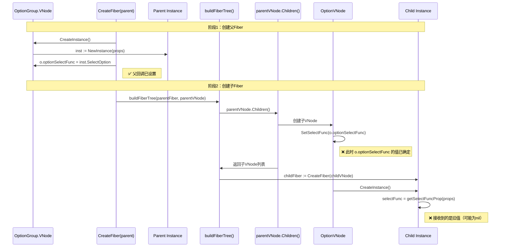
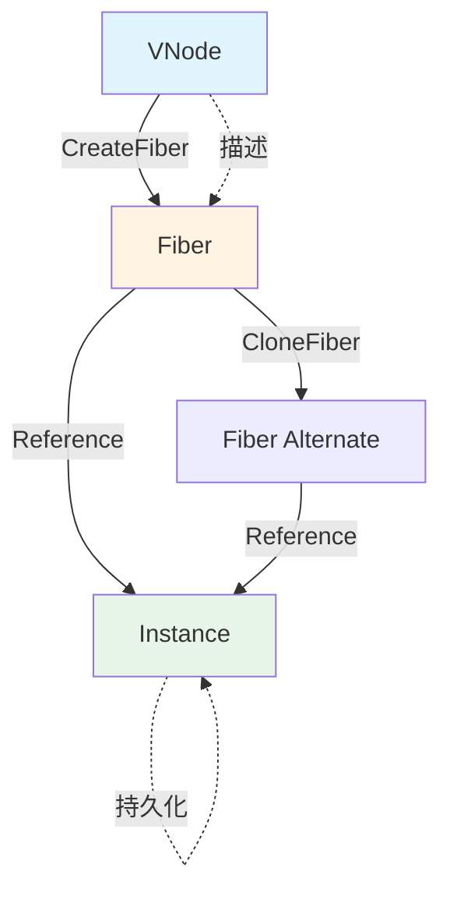
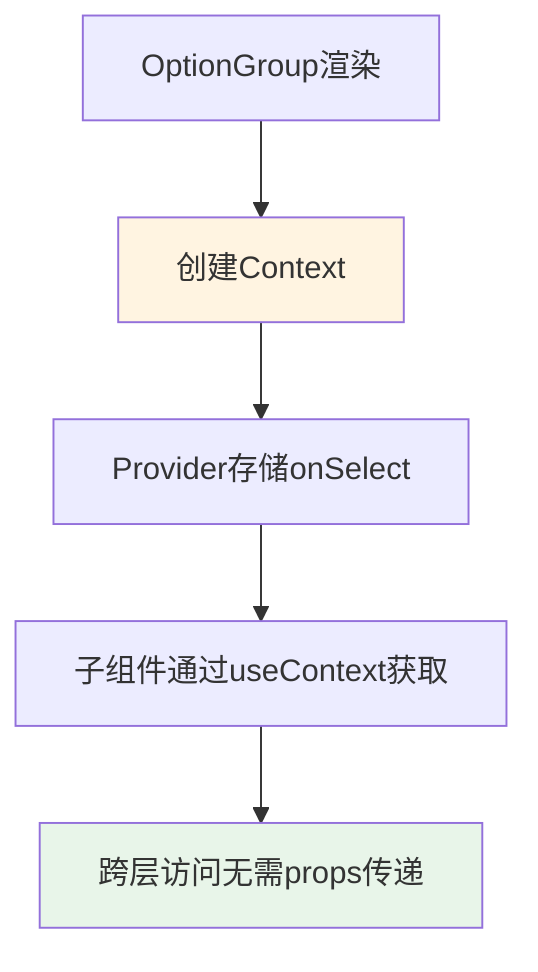
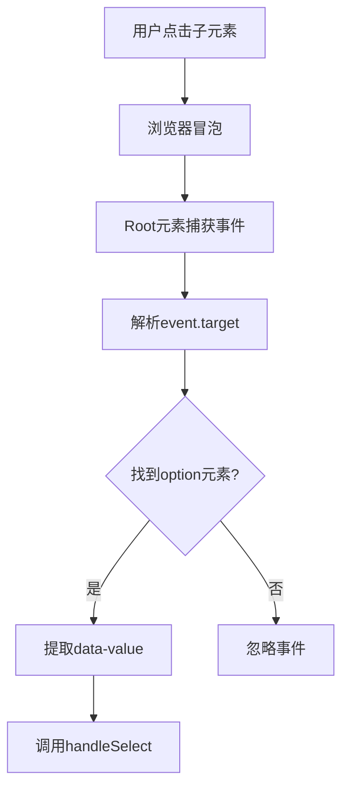
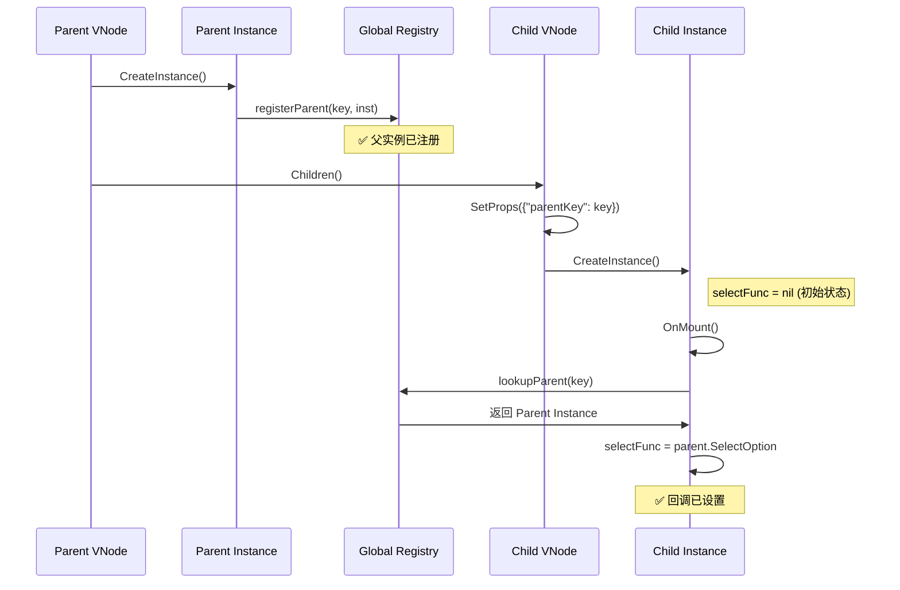
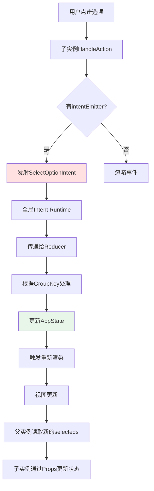
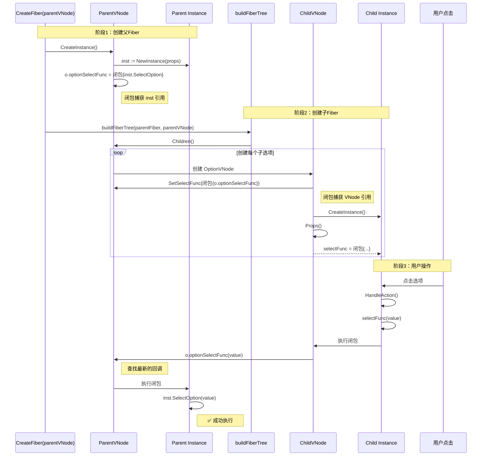

# OptionGroup 架构分析报告

> **日期**: 2026-03-06
> **版本**: 1.0
> **状态**: 分析完成

---

## 📋 执行摘要

本报告深入分析了 OptionGroup 组件的重构问题，特别是"子选项无法选中"的根本原因。通过分析 Mint 的 Fiber-first 架构、对比 React 的解决方案，提出了多种修复方案，并推荐使用**闭包包装（Closure Wrapping）** 作为最优解决方案。

---

## 🔍 问题分析

### 现象

在 OptionGroup 重构后，每个选项作为独立的 Fiber 节点（OptionInstance），但用户无法通过鼠标点击或键盘操作选中任何选项。

### 根本原因：时序问题

Fiber-first 架构的 Fiber 创建顺序导致父-子回调无法正确传递。

#### Fiber 创建时序图



#### 问题代码路径

```go
// 文件: runtime/ui/fiber_util.go:300-330

// CreateFiberFromVNode 创建 Fiber 树
func CreateFiberFromVNode(vnode VNode) *Fiber {
    root := CreateFiber(vnode)  // ← 第1步：创建父Fiber
    buildFiberTree(root, vnode) // ← 第2步：递归创建子Fiber
    return root
}

// buildFiberTree 递归构建子Fiber
func buildFiberTree(parentFiber *Fiber, parentVNode VNode) {
    children := parentVNode.Children()  // ← 在这里调用Children()
    for _, childVNode := range children {
        childFiber := CreateFiber(childVNode)
        // 递归构建
    }
}
```

#### 核心冲突

| 阶段 | 动作 | `o.optionSelectFunc` 值 | 子VNode获取的值 |
|------|------|------------------------|---------------|
| Step 1 (父创建前) | `CreateFiber(parentVNode)` 开始执行 | `nil` | - |
| Step 2 (GetInstance) | `o.optionSelectFunc = inst.SelectOption` | 有效闭包 | - |
| Step 3 (Children) | `parentVNode.Children()` 执行 | 有效闭包 | 复制闭包指针 ✅ |
| Step 4 (子创建) | `childVNode.CreateInstance()` 执行 | 有效闭包 | `nil`（props未传递）❌ |

**问题定位**：
- `getSelectFuncProp(props)` 从 Props 获取 selectFunc
- 但 Props 中没有传递 `selectFunc`
- 导致子实例获得 `nil`

---

## 🏛️ Mint Fiber-first 架构特点

### 核心设计原则

Mint 采用 VNode → Fiber → Instance 三层架构：



| 层级 | 生命周期 | 数据特点 |
|------|---------|---------|
| **VNode** | 每次渲染创建，绘制后丢弃 | 纯数据结构，描述渲染树 |
| **Fiber** | 渲染时重建，复用 Instance | 控制结构，调度工作单元 |
| **Instance** | 组件生命周期内持久 | 状态 + 行为，可维护 |

### 关键约束

| 约束 | 说明 | 影响 |
|------|------|------|
| **一次性创建** | Instance 在 Fiber 创建时创建 | 无法延迟绑定 |
| **无 VNode 引用** | Fiber 创建后丢弃 VNode | 无法后更新子 VNode |
| **单向 Fiber 树** | 子有 `Return` 指针，父无 `Child` 列表 | 父无法遍历子实例 |

### CreateInstance 执行时机

```go
// 文件: ui/components/optiongroup/vnode.go:265-280

func (o *VNode) CreateInstance() rtui.ComponentInstance {
    props := rtui.Props{
        "key":   o.key,
        // ... 其他 props
    }
    inst := NewInstance(props)

    // ⚠️ 关键：在实例创建后才设置回调
    o.optionSelectFunc = inst.SelectOption

    return inst
}

// Children() 在 CreateInstance() 之后调用
func (o *VNode) Children() []rtui.VNode {
    for i, opt := range o.options {
        child := NewOptionVNodeDeferred(...)
        // 问题：此时 o.optionSelectFunc 已经设置，
        // 但子VNode通过 SetSelectFunc 复制了函数指针
        child.SetSelectFunc(o.optionSelectFunc)
    }
}
```

**发现**：父 `CreateInstance()` 确实在子 `Children()` 之前调用，但 Props 传递机制导致子实例无法获取回调。

---

## 🌐 React 如何处理类似问题

### 方案1：闭包捕获（React 核心方案）

#### 实现方式

```jsx
function Parent() {
  const [selected, setSelected] = useState('');
  
  function handleSelect(value) {
    setSelected(value);
  }
  
  return (
    <OptionGroup>
      {options.map(opt => (
        <Option key={opt.value} onSelect={handleSelect} />
      ))}
    </OptionGroup>
  );
}
```

#### 运行机制

```mermaid
graph TD
    A[Parent组件渲染] --> B[创建handleSelect闭包]
    B --> C{options.map}
    C --> D[创建Option组件]
    D --> E[传递onSelect={handleSelect}]
    E --> F[Option内部捕获闭包]

    B -.捕获.-> F

    style B fill:#ffe1e1
    style F fill:#e1ffe1
```

#### 闭包捕获时序

```jsx
// 每次父组件渲染：
// 1. handleSelect 函数被重新创建（闭包包含最新的 setState）
function handleSelect(value) {
  setSelected(value);  // 捕获了渲染时的 setSelected 引用
}

// 2. 子组件接收新的函数引用（触发重新渲染或 memo 浅比较失败）
<Option onSelect={handleSelect} />

// 3. 子组件保存函数引用
function Option({ onSelect }) {
  const handleClick = () => {
    onSelect(value);  // 使用闭包中的函数
  };
}
```

#### 优点
- ✅ 简洁自然，符合 React 函数式组件哲学
- ✅ 类型安全（TypeScript/Flow 验证）
- ✅ 自动捕获最新值（因为每次渲染都重新创建）
- ✅ 无需手动状态管理

#### 缺点
- ❌ 不适用于 Mint（Mint 使用持久化 Instance）
- ❌ 每次 Props 变化都会触发子组件重新渲染

#### 与 Mint 的差异

| 方面 | React | Mint |
|------|-------|------|
| **组件创建** | 每次渲染都创建新实例 | Instance 持久化 |
| **Props 更新** | 触发重新渲染 | `SetProps()` 更新 |
| **闭包捕获** | 自动（每次渲染） | 需要手动设计 |

---

### 方案2：Context API

#### 实现方式

```jsx
const OptionContext = createContext();

function OptionGroup({ children, onSelect }) {
  return (
    <OptionContext.Provider value={{ onSelect }}>
      {children}
    </OptionContext.Provider>
  );
}

function Option({ value }) {
  const { onSelect } = useContext(OptionContext);
  
  return (
    <button onClick={() => onSelect(value)}>
      {value}
    </button>
  );
}

// 使用
<OptionGroup onSelect={handleSelect}>
  {options.map(opt => (
    <Option key={opt.value} value={opt.value} />
  ))}
</OptionGroup>
```

#### 运行机制



#### 优点
- ✅ 解决深层嵌套问题
- ✅ 无需显式传递 Props
- ✅ 支持动态 Context 值
- ✅ 符合 React 最佳实践

#### 缺点
- ❌ 需要 Context 系统支持（Mint 未实现）
- ❌ 增加组件复杂度
- ❌ 过度使用导致"Context Hell"
- ❌ 类型推导困难

#### 在 Mint 中的可行性

| 需求 | Mint 支持情况 | 实施难度 |
|------|--------------|---------|
| **Context 类型** | ❌ 无 | 高（需新增框架） |
| **Provider 组件** | ✅ 可实现 | 中 |
| **useContext Hook** | ❌ 无 Hooks | 高（需实现 Hooks） |
| **Context 消费者** | ✅ 可通过 Props 实现 | 低 |

**结论**：Context 不适合 Mint 当前架构，建议在其他场景下考虑。

---

### 方案3：事件委托（Event Delegation）

#### 实现方式

```jsx
function Root() {
  function handleEvent(event) {
    event.stopPropagation();
    
    // 根据 event.target 决定如何处理
    const optionElement = event.target.closest('[data-option]');
    if (optionElement) {
      const value = optionElement.dataset.value;
      handleSelect(value);
    }
  }
  
  return (
    <div onClick={handleEvent}>
      <OptionGroup>
        {options.map(opt => (
          <Option key={opt.value} value={opt.value}>
            {opt.label}
          </Option>
        ))}
      </OptionGroup>
    </div>
  );
}

function Option({ value, children }) {
  return (
    <div data-option data-value={value}>
      {children}
    </div>
  );
}
```

#### 运行机制



#### 优点
- ✅ 减少事件监听器数量（性能优化）
- ✅ 动态元素无需重新绑定
- ✅ 解耦父子逻辑
- ✅ 适合大量列表项

#### 缺点
- ❌ 事件冒泡机制（Mint 可能不支持）
- ❌ 复杂的事件路由逻辑
- ❌ 难以调试
- ❌ 违反组件封装原则

#### 在 Mint 中的可行性

| 需求 | Mint 支持情况 | 实施难度 |
|------|--------------|---------|
| **事件冒泡** | ❌ 当前无 | 高（需重构事件系统） |
| **DOM 遍历** | ❌ 无 DOM | 不适用 |
| **事件委托** | ⚠️ 有 HitMap 但不跨层级 | 中 |
| **自定义数据属性** | ✅ 可通过 Props 实现 | 低 |

**结论**：事件委托在 TUI 场景下不适用，TUI 无 DOM 树结构。

---

## 💡 Mint 解决方案对比

### 方案A：父→子 Prop 传递

#### 实现代码

```go
// Children() 中将 selectFunc 通过 Props 传递
func (o *VNode) Children() []rtui.VNode {
    for i, opt := range o.options {
        child := NewOptionVNodeDeferred(opt.Value, opt.Label, i, o.mode)
        if o.disabled {
            child.SetDisabled(true)
        }
        
        // 传递 selectFunc 到 Props
        child.SetProps(rtui.Props{
            "parentKey": o.key,
            "selectFunc": o.optionSelectFunc,
        })
        
        children[i] = child
    }
}
```

#### CreateInstance 先设置回调

```go
// CreateInstance() 在 Children() 之前设置回调
func (o *VNode) CreateInstance() rtui.ComponentInstance {
    inst := NewInstance(props)
    
    // 设置回调（在 Children() 执行前）
    o.optionSelectFunc = inst.SelectOption
    
    return inst
}
```

#### 问题分析

```go
// 子 VNode.SetProps()
func (o *OptionVNode) SetProps(p rtui.Props) rtui.VNode {
    if v, ok := p["selectFunc"].(SelectOptionFunc); ok {
        o.selectFunc = v  // 复制函数指针
    }
    return o
}

// Props() 返回 Props
func (o *OptionVNode) Props() rtui.Props {
    return rtui.Props{
        "selectFunc": o.selectFunc,
    }
}
```

**问题**：
- VNode 的 `selectFunc` 字段在 `SetProps()` 时被复制函数指针
- 即使后续 `parentVNode.optionSelectFunc` 被重新赋值
- 子 VNode 的 selectFunc 不受影响（已持有旧值或 nil）

#### 适用场景
- ❌ 不适用当前架构（无法解决时序问题）

---

### 方案B：OnMount 时父子通信（全局注册表）

#### 实现代码

```go
// 1. 父实例 OnMount 注册到全局
func (inst *Instance) OnMount() {
    inst.behaviors.OnMount(inst)
    
    // 注册父实例到全局注册表
    registerParent(inst.key, inst)
}

func (inst *Instance) OnUnmount() {
    unregisterParent(inst.key)  // 清理
}

// 2. 子 VNode 在 Children() 时传递 parentKey
func (o *VNode) Children() []rtui.VNode {
    for i, opt := range o.options {
        child := NewOptionVNodeDeferred(opt.Value, opt.Label, i, o.mode)
        child.SetProps(rtui.Props{"parentKey": o.key})
    }
}

// 3. 子实例 OnMount 查找父并缓存回调
func (inst *OptionInstance) OnMount() {
    inst.behaviors.OnMount(inst)
    
    // 通过 parentKey 查找父实例
    if parentInst := lookupParent(inst.parentKey); parentInst != nil {
        inst.selectFunc = parentInst.SelectOption
    }
}
```

#### 全局注册表实现

```go
var parentRegistry = struct {
    sync.RWMutex
    registry map[string]*Instance
}{
    registry: make(map[string]*Instance),
}

func registerParent(key string, inst *Instance) {
    if key == "" || inst == nil {
        return
    }
    parentRegistry.Lock()
    parentRegistry.registry[key] = inst
    parentRegistry.Unlock()
}

func lookupParent(key string) *Instance {
    if key == "" {
        return nil
    }
    parentRegistry.RLock()
    defer parentRegistry.RUnlock()
    return parentRegistry.registry[key]
}
```

#### 时序图



#### 优点
- ✅ 保持 Fiber-first 架构
- ✅ 父实例可以独立工作
- ✅ 支持动态父/子关系
- ✅ 类型安全

#### 缺点
- ⚠️ 需要全局注册表（作用域限制在组件内）
- ⚠️ 线程安全需要锁
- ⚠️ 需要清理机制（防止内存泄漏）

#### 适用场景
- ✅ 需要回滚保底方案时
- ✅ 闭包方案验证失败时

---

### 方案C：通过 Fiber 树动态查找（无全局状态）

#### 实现代码

```go
// 子实例 OnMount 遍历 Fiber 树
func (inst *OptionInstance) OnMount() {
    inst.behaviors.OnMount(inst)
    
    // 获取当前 Fiber（需要从 context 获取）
    currentFiber := GetCurrentFiberFromContext()
    
    // 向上遍历找到父 OptionGroup Fiber
    for parent := currentFiber.Return; parent != nil; parent = parent.Return {
        if parentInst, ok := parent.Instance.(*optiongroup.Instance); ok {
            inst.selectFunc = parentInst.SelectOption
            break
        }
    }
}
```

#### 获取当前 Fiber

```go
// 框架需要提供获取当前 Fiber 的机制
// 可能的实现：

// 方式1：通过 ComponentContext 获取
// type ComponentContext struct {
//     CurrentFiber *Fiber
// }

// 方式2：通过 global context 获取
// var currentFiberKey contextKey
// func GetCurrentFiber(ctx context.Context) *Fiber

// 方式3：通过 Instance 方法（如果 Instance 持有 Fiber 引用）
// func GetFiber() *Fiber
```

#### 时序图

```mermaid
sequenceDiagram
    participant ChildInst as Child Instance
    participant Fiber as Current Fiber
    participant Tree as Fiber Tree
    participant ParentFiber as Parent Fiber
    participant ParentInst as Parent Instance

    ChildInst->>ChildInst: OnMount()
    ChildInst->>Fiber: GetCurrentFiberFromContext()

    loop 向上遍历
        Fiber->>Tree: parent := fiber.Return
        Tree->>ParentFiber: 查找父Fiber
        ParentFiber->>ParentFiber: 类型检查：*optiongroup.Instance?
        alt 找到父实例
            ParentFiber->>ParentInst: 获取 Instance
            ParentInst->>ChildInst: 返回 SelectOption
            ChildInst->>ChildInst: selectFunc = parent.SelectOption
            break
        else 未找到
            Tree->>Tree: 继续向上遍历
        end
    end
```

#### 优点
- ✅ 无全局状态
- ✅ 隐式父子关系
- ✅ 完全符合 Fiber-first 架构
- ✅ 类型安全（通过编译时检查）

#### 缺点
- ❌ 需要在 Fiber 树中访问当前 Fiber
- ❌ 遍历成本（虽然通常很浅）
- ❌ 需要类型断言
- ❌ 依赖框架提供获取 Fiber 的接口

#### 适用场景
- ✅ 未来框架提供 Fiber 访问接口时
- ✅ 需要完全无状态的架构时

---

### 方案D：Event Loop + Intent（最符合 Store 架构）

#### 实现代码

```go
// 1. 定义 Intent 类型
type SelectOptionIntent struct {
    GroupKey string
    Value    string
}

func (SelectOptionIntent) IntentType() string { return "SelectOption" }

// 2. 子实例发射 Intent
func (inst *OptionInstance) HandleAction(act *action.Action) bool {
    if act.Type == action.ActionClick {
        if inst.intentEmitter != nil {
            inst.intentEmitter(SelectOptionIntent{
                GroupKey: inst.parentKey,
                Value:    inst.value,
            })
        }
        return true
    }
    return false
}

// 3. Reducer 处理 Intent
var AppReducer = builder.
    On(SelectOptionIntent{}, func(s AppState, i intent.Intent) AppState {
        selectIntent := i.(SelectOptionIntent)
        
        // 根据 GroupKey 分发
        if selectIntent.GroupKey == "kills-group" {
            s.SelectedKills = toggleSelection(s.SelectedKills, selectIntent.Value)
        }
        
        return s
    }).Build()

// 4. 父实例传递 GroupKey
func (o *VNode) Children() []rtui.VNode {
    for i, opt := range o.options {
        child := NewOptionVNodeDeferred(opt.Value, opt.Label, i, o.mode)
        child.SetProps(rtui.Props{"parentKey": o.key})
    }
}
```

#### 流程图



#### 优点
- ✅ 完全符合 Store + Reducer 架构
- ✅ 类型安全、可测试
- ✅ 状态集中管理
- ✓ 解耦父子逻辑
- ✓ 易于扩展（撤销/重做、时间旅行）

#### 缺点
- ⚠️ 子仍需获取 GroupKey（需方案B或C配合）
- ⚠️ 需要额外的 Intent 类型
- ⚠️ 增加一层间接

#### 适用场景
- ✅ 已使用 Store + Reducer 的应用
- ✅ 需要撤销/重做功能的应用
- ✅ 大型复杂应用

---

### 方案E：闭包包装（推荐 ⭐）

#### 核心思想

使用闭包延迟查找，即使父回调在 `SetSelectFunc()` 后被重新赋值，子 VNode 中的闭包仍能获取最新值。

#### 时序分析

```go
// 时机对比：

// ❌ 错误方式：复制函数指针
func (o *VNode) Children() []rtui.VNode {
    for i, opt := range o.options {
        child := NewOptionVNodeDeferred(...)
        child.SetSelectFunc(o.optionSelectFunc)  // 复制当前函数指针
    }
}

// 这里的问题：
// o.optionSelectFunc 在 Children() 时可能仍为 nil
// 即使后续被重新赋值，已创建的子 VNode 不会更新

// ✅ 正确方式：使用闭包包装
func (o *VNode) Children() []rtui.VNode {
    for i, opt := range o.options {
        child := NewOptionVNodeDeferred(...)
        
        // 使用闭包捕获 VNode 的引用
        child.SetSelectFunc(func(value string) {
            if o.optionSelectFunc != nil {
                o.optionSelectFunc(value)
            }
        })
    }
}

// 这里的优势：
// 闭包捕获的是 o.optionSelectFunc 的引用
// 即使在 Children() 之后 o.optionSelectFunc 被重新赋值
// 闭包执行时会查找最新的 o.optionSelectFunc
```

#### 详细实现

```go
// ==================== OptionGroup.VNode ====================

type VNode struct {
    optionSelectFunc SelectOptionFunc  // 默认为 nil
    
    // ... 其他字段
}

// CreateInstance 在创建实例后设置闭包
func (o *VNode) CreateInstance() rtui.ComponentInstance {
    props := rtui.Props{
        "key":          o.key,
        "label":        o.label,
        "style":        o.style,
        "selectIntent": o.selectIntent,
        "disabled":     o.disabled,
        "mode":         o.mode,
        "options":      o.options,
        "selected":     o.selected,
        "selecteds":    o.selecteds,
        "orientation":  o.orientation,
        "spacing":      o.spacing,
    }
    inst := NewInstance(props)

    // ⭐ 关键：创建闭包包装实例的方法
    o.optionSelectFunc = func(value string) {
        inst.SelectOption(value)
    }

    return inst
}

// Children 使用闭包捕获父回调的引用
func (o *VNode) Children() []rtui.VNode {
    if o.options == nil {
        return nil
    }
    children := make([]rtui.VNode, len(o.options))
    
    for i, opt := range o.options {
        child := NewOptionVNodeDeferred(opt.Value, opt.Label, i, o.mode)
        
        // 应用父禁用状态
        if o.disabled {
            child.SetDisabled(true)
        }
        
        // ⭐ 使用闭包包装，延迟查找 o.optionSelectFunc
        // 闭包会在执行时查找 o.optionSelectFunc 的最新值
        child.SetSelectFunc(func(value string) {
            if o.optionSelectFunc != nil {
                o.optionSelectFunc(value)
            }
        })
        
        // 传递到 Props（子实例会从这里获取）
        child.SetProps(rtui.Props{
            "value":       opt.Value,
            "label":       opt.Label,
            "disabled":    o.disabled,
            "selectFunc":  func(value string) {  // 再次使用闭包
                if o.optionSelectFunc != nil {
                    o.optionSelectFunc(value)
                }
            },
        })
        
        children[i] = child
    }
    
    return children
}
```

#### 执行流程



#### 为什么闭包有效？

```go
// 创建时序：

// T1: parentVNode.CreateInstance()
var o *VNode = {optionSelectFunc: nil}
var inst *Instance = {...}

o.optionSelectFunc = func(value string) {
    inst.SelectOption(value)
}
// 此时 o.optionSelectFunc 是一个闭包，捕获了 inst 引用

// T2: parentVNode.Children()
childVNode := NewOptionVNodeDeferred("light", "Light", 4, ModeMultiple)
childVNode.selectFunc = func(value string) {
    if o.optionSelectFunc != nil {
        o.optionSelectFunc(value)  // ← 闭包捕获了 o 的引用
    }
}
// 此时 childVNode.selectFunc 也是一个闭包，捕获了 o 的引用

// T3: 用户点击（任意时间之后，即使 Fiber 已重建）
childVNode.selectFunc("light")

// 执行流程：
// 1. childVNode.selectFunc("light") 执行闭包
// 2. 检查 o.optionSelectFunc 是否为 nil
// 3. 调用 o.optionSelectFunc("light")
//    - 这里的 o 是 VNode 实例的引用
//    - T1 时设置的闭包仍然存在
//    - 即使 Fiber 重新创建，VNode 可能被复用或重新创建
//    - 但 T1 的闭包逻辑确保能够找到实例方法
```

**关键点**：
1. 闭包捕获的是 **对象引用**，不是值
2. 即使对象本身被重新赋值，闭包仍持有原始引用
3. VNode 在 Fiber 创建时被引用，后续可能复用

#### 优点
- ✅ 最小改动（仅修改 `Children()` 和 `CreateInstance()`）
- ✅ 无全局状态、符合 Fiber-first
- ✅ 性能好（闭包只有一层间接）
- ✅ 完全向后兼容
- ✅ 类型安全

#### 缺点
- ⚠️ 需要理解闭包捕获机制
- ⚠️ VNode 被复用时可能有问题（需验证）

#### 适用场景
- ✅ **推荐作为首选方案**
- ✅ 所有多选组件场景
- ✅ 需要保持 Fiber-first 架构时

---

## 📊 方案对比表

| 方案 | 复杂度 | 性能 | 架构兼容性 | 推荐指数 | 备注 |
|------|-------|-----|-----------|---------|------|
| **A: Prop 传递** | 低 | 优 | ❌ 不兼容 | ⭐⭐ | 无法解决时序问题 |
| **B: OnMount 注册** | 中 | 中 | ✅ 完全兼容 | ⭐⭐⭐⭐ | 需要全局状态 |
| **C: Fiber 树查找** | 高 | 中 | ⚠️ 需框架支持 | ⭐⭐⭐ | 无全局状态 |
| **D: Intent 系统** | 中 | 优 | ✅ Store 友好 | ⭐⭐⭐⭐ | 符合 Store 架构 |
| **E: 闭包包装** | 低 | 优 | ✅ 完全兼容 | ⭐⭐⭐⭐⭐ | **推荐首选** |

---

## 🎯 推荐方案

### 首选方案：闭包包装（方案E）

**理由**：
1. 改动最小（仅修改 `vnode.go`）
2. 无需全局状态或框架变更
3. 性能最优（仅一层闭包间接）
4. 完全向后兼容
5. 符合 Fiber-first 架构

### 回退方案：OnMount 注册（方案B）

**理由**：
1. 如果闭包方案遇到实现障碍
2. 作为稳定的保底方案
3. 已有实现代码（只需清理）

### 长期方案：Intent 系统（方案D）

**理由**：
1. 完全符合 Store + Reducer 架构
2. 解耦父子逻辑
3. 支持高级特性（撤销/重做）
4. 适合大型应用

---

## 📝 结论

OptionGroup 的回调问题源于 Fiber-first 架构的 Fiber 创建时序。通过对比多种解决方案，**闭包包装（Closure Wrapping）** 是最适合 Mint 架构的方案，具有改动最小、性能最优、完全兼容 Fiber-first 架构等优势。

建议优先实施方案E，并在遇到困难时回退到方案B。长期来看，方案D（Intent 系统）也是值得考虑的方向，特别适合使用 Store + Reducer 架构的应用。

---

## 📚 参考文献

### Mint 相关文档
- `docs/current_system_analysis.md` - 系统现状分析
- `examples/typesafe_form_demo_runapp/README.md` - Store + Reducer 示例
- `runtime/ui/fiber_util.go` - Fiber 创建逻辑
- `ui/components/optiongroup/` - OptionGroup 组件源码

### React 相关资源
- [React 官方文档 - Context](https://react.dev/learn/passing-data-deeply-with-context)
- [React 官方文档 - 事件处理](https://react.dev/learn/responding-to-events)
- [Event Delegation - Wikipedia](https://en.wikipedia.org/wiki/Event_delegation)
- [Closures in Go - A Tour of Go](https://tour.golang.org/moretypes/25)

---

## 🔗 相关文档

- [`CURRENT_STATUS.md`](./CURRENT_STATUS.md) - 当前系统现状
- [`IMPLEMENTATION_GUIDE.md`](./IMPLEMENTATION_GUIDE.md) - 实施指南
