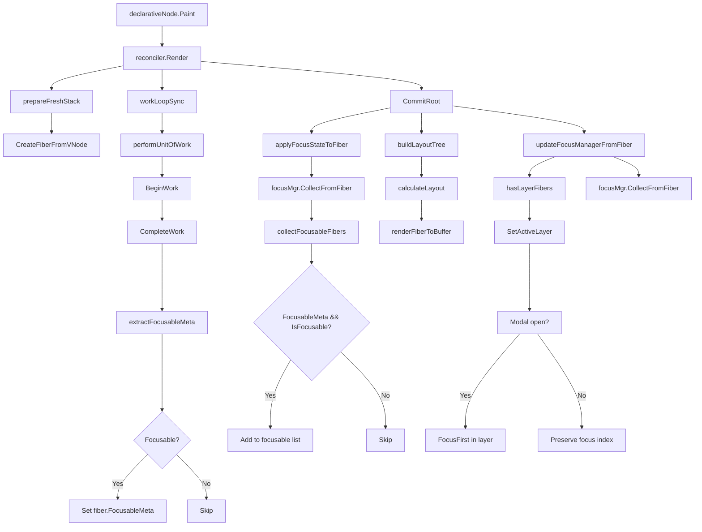
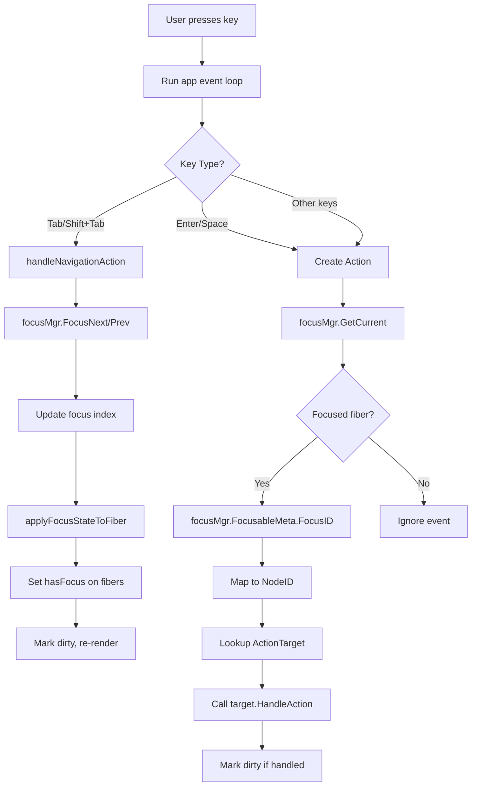

# Focus Management Analysis - UI Components

## Table of Contents
1. [Overview](#overview)
2. [Component Focusable Support](#component-focusable-support)
3. [Framework.App Integration](#frameworkapp-integration)
4. [Focus Manager Architecture](#focus-manager-architecture)
5. [Call Path Analysis](#call-path-analysis)
6. [Intent 正确使用方法](#intent-正确使用方法)
7. [使用 ui.Run() 启动应用](#使用-uirun-启动应用)

---

## Overview

This document analyzes the focus management implementation in the Mint UI framework, specifically focusing on:
1. Which `/ui/components/` components support focus management
2. How `framework.App` integrates with `FocusManager`
3. The complete focus collection and routing architecture

**Architecture Principle**: Fiber-first - all runtime state (focus, hover, etc.) is stored in Fiber nodes, not VNodes.

---

## Component Focusable Support

### Full Focusable Support

The following components implement the `rtui.FocusableInstance` interface:

#### 1. Button (`ui/components/button/instance.go`)

**Focusable Condition**: `!disabled`

---

#### 2. Input (`ui/components/input/vnode.go`)

```go
type VNode struct {
    disabled bool      // Disabled state
    readOnly bool      // Read-only state
    key      string    // Component key
    placeholder string
    value    string
    // ... other fields
}

```

**Focus ID Format**: `input:{key}` or `input:{placeholder}`

**Focusable Condition**: `!disabled && !readOnly`

---

#### 3. Textarea (`ui/components/textarea/vnode.go`)

```go
type VNode struct {
    hasFocus bool      // Focus state for rendering
    disabled bool      // Disabled state
}

func (t *VNode) SetFocus(hasFocus bool) {
    t.hasFocus = hasFocus
}

func (t *VNode) IsFocusable() bool {
    return !t.disabled
}

func (t *VNode) GetFocusID() string {
    // Implementation returns focus ID
}
```

**Focus ID Format**: `textarea:{key}` or `textarea:{value}`

**Focusable Condition**: `!disabled`

---

#### 4. Select (`ui/components/select/vnode.go`)

```go
type VNode struct {
    hasFocus bool      // Focus state for rendering
    disabled bool      // Disabled state
}

func (s *VNode) SetFocus(hasFocus bool) {
    s.hasFocus = hasFocus
}

func (s *VNode) IsFocusable() bool {
    return !s.disabled
}

func (s *VNode) GetFocusID() string {
    if s.key != "" {
        return "select:" + s.key
    }
    return "select:" + s.placeholder
}
```

**Focus ID Format**: `select:{key}` or `select:{placeholder}`

**Focusable Condition**: `!disabled`

---

#### 5. Checkbox (`ui/components/checkbox/vnode.go`)

```go
type VNode struct {
    hasFocus bool      // Focus state for rendering
    disabled bool      // Disabled state
}

func (c *VNode) SetFocus(hasFocus bool) {
    c.hasFocus = hasFocus
}

func (c *VNode) IsFocusable() bool {
    return !c.disabled
}

func (c *VNode) GetFocusID() string {
    if c.key != "" {
        return "checkbox:" + c.key
    }
    return "checkbox:" + c.label
}
```

**Focus ID Format**: `checkbox:{key}` or `checkbox:{label}`

**Focusable Condition**: `!disabled`

---

### Components Without Explicit Focusable Support

The following component directories exist but do NOT focus explicitly implement `FocusableInstance`:

| Component | Dir Exists | FocusableInstance | Notes |
|-----------|------------|----------------|-------|
| `absolute` | ✅ | ❌ | Container component |
| `border` | ✅ | ❌ | Visual decoration |
| `control` | ✅ | ❌ | Container component |
| `divider` | ✅ | ❌ | Visual separator |
| `grid` | ✅ | ❌ | Layout container |
| `list` | ✅ | ❌ | Data display |
| `modal` | ✅ | ❌ | Focus trap (uses layer system) |
| `panel` | ✅ | ❌ | Container component |
| `progress` | ✅ | ❌ | Display only |
| `scrollview` | ✅ | ❌ | Scroll container |
| `stack` | ✅ | ❌ | Layout container |
| `table` | ✅ | ❌ | Data display |
| `tabs` | ✅ | ❌ | Container (has focusable buttons) |
| `text` | ✅ | ❌ | Display only |
| `tooltip` | ✅ | ❌ | Overlay only |
| `treeview` | ✅ | ❌ | Complex tree navigation |
| `virtuallist` | ✅ | ❌ | Optimized list |
| `wrap` | ✅ | ❌ | Layout container |

---

## Framework.App Integration

### App Structure

```go
type App struct {
    // Focus Management (Fiber-first)
    focusManager *rtui.FiberFocusManager

    // Action Support
    actionRegistry   map[uint64]action.ActionTarget
    focusIDToNodeID  map[string]uint64

    // Root Component
    root component.Node
    // ... other fields
}
```

---

### Initialization

The `App` initializes its own `FiberFocusManager`:

```go
// NewApp() creates a new application
func NewApp(options ...Option) *App {
    a := &App{
        focusManager: rtui.NewFiberFocusManager(),  // Fiber-first: Focus manager
        actionRegistry: make(map[uint64]action.ActionTarget),
        focusIDToNodeID: make(map[string]uint64),
        // ... other initialization
    }
    return a
}
```

---

### FocusManager Synchronization

**Critical Integration Point**: The `App` syncs its `focusManager` from the `DeclarativeNode`.

```go
// buildActionRegistry() - called during render phase
func (a *App) buildActionRegistry() {
    if a.root == nil {
        return
    }

    // Clear old registry
    a.actionRegistry = make(map[uint64]action.ActionTarget)
    a.focusIDToNodeID = make(map[string]uint64)

    // Get FocusManager from DeclarativeNode (Fiber-first)
    if declNode, ok := a.root.(interface {
        GetFocusManager() *rtui.FiberFocusManager
    }); ok {
        focusMgr := declNode.GetFocusManager()
        if focusMgr != nil {
            // Sync to App's focusManager (Critical!)
            a.focusManager = focusMgr

            // Collect ActionTargets from focusable fibers
            focusable := focusMgr.GetFocusable()
            for _, fiber := range focusable {
                if fiber.ComponentInstance != nil {
                    if target, ok := fiber.ComponentInstance.(action.ActionTarget); ok {
                        // Use FocusableMeta.FocusID
                        if fiber.FocusableMeta != nil {
                            focusID := fiber.FocusableMeta.FocusID
                            if focusID != "" {
                                nodeID := runtimeevent.StringToNodeID(focusID)
                                a.focusIDToNodeID[focusID] = nodeID
                                a.actionRegistry[nodeID] = target
                            }
                        }
                    }
                }
            }
        }
    }
}
```

**Key Points**:
1. App delegates focus management to `DeclarativeNode.focusMgr`
2. Focusable components are registered as `ActionTarget`s
3. `focusID -> nodeID` mapping is maintained for routing

---

### Keyboard Event Routing

**Navigation Actions** (Tab, Shift+Tab, etc.) are routed directly to `FocusManager`:

```go
// handleNavigationAction() - Tab, arrow keys, etc.
func (a *App) handleNavigationAction(act *action.Action) {
    if a.focusManager == nil {
        return
    }

    var handled bool
    switch act.Type {
    case action.ActionNavigateNext:
        handled = a.focusManager.FocusNext()
    case action.ActionNavigatePrev:
        handled = a.focusManager.FocusPrev()
    case action.ActionNavigateHome:
        handled = a.focusManager.FocusFirst()
    case action.ActionNavigateEnd:
        handled = a.focusManager.FocusLast()
    }

    if handled {
        a.dirty = true  // Trigger re-render
    }
}
```

**Special Keys** (Enter, Space, Escape) are routed to the **focused component** via `ActionRouter`:

```go
// Route keyboard events to focused component
if keyEv, ok := msg.(*runtimemsg.KeyMsg); ok {
    // Check for special navigation keys (Tab)
    if keyEv.Special == runtimemsg.KeyTab {
        var handled bool
        if keyEv.Modifiers == runtimemsg.ModShift {
            handled = a.focusManager.FocusPrev()
        } else {
            handled = a.focusManager.FocusNext()
        }
        if handled {
            a.dirty = true
            return
        }
    }

    // Other keys route to focused component via ActionRouter
    if focused := a.focusManager.GetCurrent(); focused != nil {
        // Convert keyboard event to Action and dispatch
        act := a.keyEventToAction(keyEv)
        if act != nil {
            result := a.dispatchAction(act)
            if result.Handled {
                a.dirty = true
            }
        }
    }
}
```

---

### Public API

```go
// GetFocusManager returns the focus manager for keyboard navigation
func (a *App) GetFocusManager() *rtui.FiberFocusManager {
    return a.focusManager
}

// SetFocusManagerFromDeclarativeNode syncs focusManager from DeclarativeNode
func (a *App) SetFocusManagerFromDeclarativeNode(fm *rtui.FiberFocusManager) {
    a.focusManager = fm
}
```

---

## Focus Manager Architecture

### FiberFocusManager Structure

```go
// runtime/ui/fiber_focus_manager.go
type FiberFocusManager struct {
    focusable   []*Fiber              // All focusable Fiber nodes
    current     int                   // Index of focused Fiber (-1 if none)
    onNavigate  func(from, to *Fiber) // Callback for focus changes
    activeLayer Layer                 // Current active layer (focus trap)
}
```

**Key Methods**:

| Method | Purpose |
|--------|---------|
| `CollectFromFiber(root *Fiber)` | Collect all focusable fibers from tree |
| `FocusNext() bool` | Move focus to next focusable item |
| `FocusPrev() bool` | Move focus to previous focusable item |
| `FocusFirst() bool` | Focus first focusable item |
| `FocusLast() bool` | Focus last focusable item |
| `SetFocusByIndex(index int) bool` | Set focus by index |
| `SetFocusByID(id string) bool` | Set focus by FocusID |
| `GetCurrent() *Fiber` | Get currently focused Fiber |
| `SetOnNavigate(fn)` | Set callback for focus changes |
| `SetActiveLayer(layer Layer)` | Set active layer (for trapping) |
| `GetActiveLayer() Layer` | Get current active layer |

---

### FocusableMeta Structure

```go
// runtime/ui/fiber_events.go
type FocusableMeta struct {
    // Configuration (set during Fiber creation)
    TabIndex int
    Disabled bool
    FocusID  string

    // Runtime State (managed by FocusManager)
    HasFocus  bool
    IsHovered bool
}

func (f *FocusableMeta) IsFocusable() bool {
    return f != nil && !f.Disabled && f.TabIndex >= 0
}
```

---

### Focus Collection Algorithm

```go
// CollectFromFiber - Recursive collection of focusable fibers
func (m *FiberFocusManager) CollectFromFiber(root *Fiber) {
    m.focusable = m.collectFocusableFibers(root)
    log.FocusLogger.Debug("CollectFromFiber: collected %d focusable fibers", len(m.focusable))
}

// collectFocusableFibers - Helper for recursive collection
func (m *FiberFocusManager) collectFocusableFibers(fiber *Fiber) []*Fiber {
    var result []*Fiber

    if fiber == nil {
        return result
    }

    // Skip root ComponentVNode wrapper
    if fiber.Key == "root" && fiber.Type == VNodeComponent {
        return m.collectFocusableFibers(fiber.Child)
    }

    // Check if current Fiber is focusable
    if fiber.FocusableMeta != nil && fiber.FocusableMeta.IsFocusable() {
        result = append(result, fiber)
    }

    // Recursively check children and siblings
    if child := fiber.Child; child != nil {
        result = append(result, m.collectFocusableFibers(child)...)
    }
    if sibling := fiber.Sibling; sibling != nil {
        result = append(result, m.collectFocusableFibers(sibling)...)
    }

    return result
}
```

---

## Call Path Analysis

### Initialization Phase

```mermaid
graph TD
    A[NewDeclarativeNodeFromFuncWithFiber] --> B[Create FiberFocusManager]
    B --> B1[rtui.NewFiberFocusManager]
    B1 --> B2[focusable=[], current=-1]
    A --> C[Create Fiber Reconciler]
    C --> C1[newFiberReconciler]
    A --> D[Adapter.SetFocusManager]
    D --> D1[r.SetFocusManager]
    D1 --> D2[reconciler.focusMgr = focusMgr]
    A --> E[Create DeclarativeNode]
    E --> E1[node.focusMgr = focusMgr]
```

### Rendering Phase - Focus Collection



### FocusableMeta Extraction Rules

```go
// extractFocusableMeta() - internal/reconciler/complete_work.go
func extractFocusableMeta(fiber *Fiber) *rtui.FocusableMeta {
    props := fiber.Props
    if props == nil {
        return nil
    }

    // Check for explicit disabled state
    disabled := false
    if d, ok := props["disabled"].(bool); ok {
        disabled = d
    }

    // Check for explicit tabIndex
    tabIndex := -1
    if ti, ok := props["tabIndex"].(int); ok {
        tabIndex = ti
    }

    // Determine if focusable
    var focusableMeta *rtui.FocusableMeta

    // Priority: explicit tabIndex > disabled check > tag-based defaults
    if tabIndex >= 0 {
        focusableMeta = &rtui.FocusableMeta{
            TabIndex: tabIndex,
            Disabled: disabled,
            FocusID:  fiber.Key,
        }
    } else if !disabled {
        // Check tag-based defaults
        switch fiber.Tag {
        case "button", "input", "textarea", "select", "checkbox":
            focusableMeta = &rtui.FocusableMeta{
                TabIndex: 0,
                Disabled: disabled,
                FocusID:  fiber.Key,
            }
        }
    }

    // Use FocusableInstance to get FocusID if available
    if focusableMeta != nil && fiber.ComponentInstance != nil {
        if focusableInst, ok := fiber.ComponentInstance.(rtui.FocusableInstance); ok {
            focusableMeta.FocusID = focusableInst.GetFocusID()
        }
    }

    return focusableMeta
}
```

**Focusable Decision Table**:

| Tag | `disabled` | `tabIndex` | Result | FocusID |
|-----|------------|------------|--------|---------|
| button/input/textarea/select/checkbox | false | -1 or 0 | ✅ Focusable | `fiber.Key` or `FocusableInstance.GetFocusID()` |
| button/input/textarea/select/checkbox | true | -1 or 0 | ❌ Not Focusable | N/A |
| any tag | false | >= 0 | ✅ Focusable | `fiber.Key` |
| any tag | true | >= 0 | ❌ Not Focusable | N/A |
| other tags | - | - | ❌ Not Focusable (no tag match) | N/A |

---

### Keyboard Event Routing - Complete Flow



---

## Summary

### Key Architecture Points

1. **Fiber-First Design**:
   - Focus state lives in `Fiber.FocusableMeta`
   - VNodes are declarative descriptions only
   - `FocusableInstance` interface is still supported but `FocusableMeta` is primary

2. **Component Support**:
   - 5 components fully support `FocusableInstance`: Button, Input, Textarea, Select, Checkbox
   - All follow the same pattern: `SetFocus()`, `IsFocusable()`, `GetFocusID()`

3. **Framework Integration**:
   - `App.focusManager` syncs with `DeclarativeNode.focusMgr`
   - Focusable fibers are registered as `ActionTarget`s
   - `focusID -> nodeID` mapping enables routing

4. **Focus Collection**:
   - 2 collections per render cycle:
     1. Before render: `applyFocusStateToFiber()` - Apply current focus
     2. After render: `updateFocusManagerFromFiber()` - Update for next render

5. **Layer Support**:
   - `FiberFocusManager` supports layer-aware focus trapping
   - Modal/Overlay layers receive focus via `SetActiveLayer()`

---

## Intent 正确使用方法

### Intent 系统简介

Mint 的 Intent 系统是一个类型安全的声明式动作系统，用于替代传统的闭包回调。Intent 可以：
- 提供类型安全的动作定义
- 支持基于优先级的调度
- 支持异步操作（Transition）
- 与 DevTools 集成支持追踪

**架构流程**：
```
Component → Emit Intent[T] → Registry → Dispatcher → Lane → Scheduler → Handler
```

### 预定义的 Intent 类型

`runtime/intent/builtin.go` 提供了多种预定义的 Intent 类型：

| Intent 类型 | 用途 | 优先级 | 构造函数 |
|------------|------|--------|----------|
| `ClickIntent` | 点击动作 | UserBlocking | `Click(targetID)` |
| `PressIntent` | 按下动作 | UserBlocking | `Press(targetID)` |
| `SetStateIntent` | 设置状态 | Normal | `SetState(key, value)` |
| `ToggleIntent` | 切换布尔状态 | UserBlocking | `Toggle(key)` |
| `FocusIntent` | 聚焦元素 | Immediate | `Focus(targetID)` |
| `BlurIntent` | 移除焦点 | Immediate | `Blur(targetID)` |
| `NavigateIntent` | 导航 | UserBlocking | `Navigate(path)` |
| `OpenModalIntent` | 打开模态框 | UserBlocking | `OpenModal(modalID)` |
| `CloseModalIntent` | 关闭模态框 | UserBlocking | `CloseModal(modalID)` |
| `LoadDataIntent` | 加载数据 | Transition | `LoadData(url, key)` |
| `RefreshIntent` | 刷新数据 | Transition | `Refresh(keys)` |

### 组件 Intent 设置方法

不同的组件使用不同的方法名来设置 Intent：

| 组件 | Intent 字段 | 方法名 |
|-----|------------|--------|
| **Button** | `pressIntent` | `SetIntent(intent.Intent)` |
| **Checkbox** | `toggleIntent` | `SetIntent(intent.Intent)` |
| **Input** | `changeIntent` | `SetChangeIntent(intent.Intent)` |
| **Textarea** | `changeIntent` | `SetChangeIntent(intent.Intent)` |
| **Select** | `changeIntent` | `SetChangeIntent(intent.Intent)` |

### 使用示例

#### 1. Button - 使用 SetIntent 和 Click/Press Intent

```go
import (
    "github.com/wwsheng009/mint/runtime/intent"
    "github.com/wwsheng009/mint/ui/components/button"
)

// 创建按钮并设置 Intent
btn := button.New("Click Me")
btn.SetIntent(intent.Click("btn1"))  // Button 使用 .SetIntent()
btn.SetKey("btn1")                   // 设置 key 可选，用于标识
```

#### 2. Checkbox - 使用 SetIntent 和 Toggle Intent

```go
import (
    "github.com/wwsheng009/mint/runtime/intent"
    "github.com/wwsheng009/mint/ui/components/checkbox"
)

// 创建复选框并设置切换 Intent
chk := checkbox.New("Enable notifications")
chk.SetIntent(intent.Toggle("checkbox-checked"))  // Checkbox 使用 .SetIntent()
chk.SetKey("chk1")
```

#### 3. Input - 使用 SetChangeIntent 和 SetState Intent

```go
import (
    "github.com/wwsheng009/mint/runtime/intent"
    "github.com/wwsheng009/mint/ui/components/input"
)

// 创建输入框并设置更改 Intent
input := input.New()
input.SetPlaceholder("Enter your name...")
input.SetChangeIntent(intent.SetState("user-name", ""))  // Input 使用 .SetChangeIntent()
input.SetKey("input1")
```

#### 4. Select - 使用 SetChangeIntent

```go
import (
    "github.com/wwsheng009/mint/runtime/intent"
    selectcomp "github.com/wwsheng009/mint/ui/components/select"
)

// 创建下拉框并设置更改 Intent
sel := selectcomp.New()
sel.SetOptions([]selectcomp.Option{
    {Value: "opt1", Label: "Option 1"},
    {Value: "opt2", Label: "Option 2"},
})
sel.SetChangeIntent(intent.SetState("selected-option", ""))
sel.SetKey("select1")
```

### 完整示例

```go
package main

import (
    "github.com/wwsheng009/mint/framework"
    "github.com/wwsheng009/mint/internal/render"
    "github.com/wwsheng009/mint/runtime/intent"
    rtui "github.com/wwsheng009/mint/runtime/ui"
    buttonComp "github.com/wwsheng009/mint/ui/components/button"
    checkboxComp "github.com/wwsheng009/mint/ui/components/checkbox"
    inputComp "github.com/wwsheng009/mint/ui/components/input"
    newstack "github.com/wwsheng009/mint/ui/components/stack"
)

func SimpleForm() rtui.VNode {
    // Button
    btn := buttonComp.New("Submit")
    btn.SetIntent(intent.Click("submit-btn"))
    btn.SetKey("btn1")

    // Input
    input := inputComp.New()
    input.SetPlaceholder("Enter data...")
    input.SetChangeIntent(intent.SetState("input-value", ""))
    input.SetKey("input1")

    // Checkbox
    chk := checkboxComp.New("Remember me")
    chk.SetIntent(intent.Toggle("remember"))
    chk.SetKey("chk1")

    return newstack.New(newstack.Column).
        SetChildrenList([]rtui.VNode{
            btn,
            input,
            chk,
        })
}

func main() {
    fwApp := framework.NewApp()
    node := render.NewDeclarativeNodeFromFuncWithFiber(SimpleForm, fwApp)
    node.SetRenderMode(render.RenderModeFiberFirst)
    // ... 运行应用
}
```

### 自定义 Intent 类型

您可以定义自己的 Intent 类型：

```go
package main

import (
    "github.com/wwsheng009/mint/runtime/intent"
)

// 自定义 Intent 类型
type IncrementCounterIntent struct {
    Step int
}

// 必须实现 Intent 接口
func (IncrementCounterIntent) IntentType() string {
    return "IncrementCounter"
}

// 可选：实现 PriorityAware 接口设置优先级
func (IncrementCounterIntent) Priority() intent.ActionPriority {
    return intent.PriorityUserBlocking
}

// 使用自定义 Intent
btn := buttonComp.New("Increment")
btn.SetIntent(IncrementCounterIntent{Step: 5})
btn.SetKey("inc-btn")
```

### Intent 优先级

优先级从高到低：

| 优先级 | 值 | 用途 |
|-------|-----|------|
| `PriorityImmediate` | 0 | 紧急阻塞操作（如焦点变化） |
| `PriorityUserBlocking` | 1 | 用户发起的动作（如点击、输入） |
| `PriorityNormal` | 2 | 标准更新（默认） |
| `PriorityTransition` | 3 | 可延迟的异步操作 |
| `PriorityIdle` | 4 | 可等待的后台任务 |

### 注意事项

1. **方法名区分**：Button 和 Checkbox 使用 `SetIntent()`，而 Input、Textarea、Select 使用 `SetChangeIntent()`
2. **SetKey 调用顺序**：SetKey 返回 `rtui.VNode` 接口类型，建议最后调用或在具体类型返回值后再调用
3. **Intent 非必需**：组件可以不设置 Intent，但此时点击/更改不会有响应
4. **自定义 Intent**：实现 `IntentType()` 方法即可，可选实现 `Priority()` 设置优先级

---

## 使用 ui.Run() 启动应用

### ui.Run 简介

`ui.Run()` 是 Mint 框架的主要入口点，用于启动基于 Fiber 的声明式 UI 应用。它自动：

1. 创建 `framework.App` 实例
2. 初始化主题（默认 dark 主题）
3. 创建带 Fiber reconciler 的 `DeclarativeNode`
4. 启动事件循环和渲染循环
5. 处理键盘事件（包括 TAB 焦点导航）

### ui.Run 签名

```go
import "github.com/wwsheng009/mint/ui"

// ComponentFunc 定义应用程序根组件
type ComponentFunc func() ui.VNode

// ui.Run 启动应用
func Run(app ComponentFunc, opts ...Option) error
```

### 可用选项

| 选项 | 类型 | 默认值 | 说明 |
|-----|------|--------|------|
| `WithWidth(width int)` | Option | 80 | 设置窗口宽度 |
| `WithHeight(height int)` | Option | 24 | 设置窗口高度 |
| `WithSize(width, height int)` | Option | 80x24 | 同时设置宽高 |
| `WithTitle(title string)` | Option | "Mint UI App" | 设置窗口标题 |
| `WithFPS(fps int)` | Option | 60 | 设置帧率限制 |
| `WithNoAlternateScreen()` | Option | false | 禁用备用屏幕模式（允许复制/滚动） |

### ui.Run 完整示例

```go
package main

import (
    "fmt"

    "github.com/wwsheng009/mint/runtime/intent"
    "github.com/wwsheng009/mint/ui"
    buttonComp "github.com/wwsheng009/mint/ui/components/button"
    checkboxComp "github.com/wwsheng009/mint/ui/components/checkbox"
    inputComp "github.com/wwsheng009/mint/ui/components/input"
    newstack "github.com/wwsheng009/mint/ui/components/stack"
    newtext "github.com/wwsheng009/mint/ui/components/text"
)

// MyApp 定义应用程序的根组件
func MyApp() ui.VNode {
    // 创建组件并设置 Intent
    btn := buttonComp.New("Submit")
    btn.SetIntent(intent.Click("submit-btn"))
    btn.SetKey("btn1")

    input := inputComp.New()
    input.SetPlaceholder("Enter your name...")
    input.SetChangeIntent(intent.SetState("username", ""))
    input.SetKey("input1")

    chk := checkboxComp.New("Remember me")
    chk.SetIntent(intent.Toggle("remember"))
    chk.SetKey("chk1")

    // 构建 UI
    return newstack.New(newstack.Column).
        SetGap(1).
        SetChildrenList([]ui.VNode{
            newtext.New("=== My Application ==="),
            btn,
            input,
            chk,
        })
}

func main() {
    // 使用 ui.Run() 启动应用
    err := ui.Run(MyApp,
        ui.WithWidth(60),
        ui.WithHeight(20),
        ui.WithTitle("My App"),
    )
    if err != nil {
        fmt.Printf("Error: %v\n", err)
    }
}
```

### 焦点管理自动集成

使用 `ui.Run()` 时，焦点管理自动集成：

1. **TAB 导航** - 自动在可聚焦组件之间移动焦点
2. **焦点收集** - 在每次渲染时自动收集所有可聚焦的 Fiber 节点
3. **键盘路由** - 自动将导航键发给 FocusManager，将操作键发给焦点组件
4. **焦点 ID** - 自动维护 focusID → nodeID 映射

### 配置 NoAlternateScreen 模式

如果您希望保留终端历史记录并支持文本复制：

```go
err := ui.Run(MyApp,
    ui.WithNoAlternateScreen(),  // 不使用备用屏幕
    ui.WithTitle("My App - Copyable"),
)
```

### 与 framework.App 直接使用的对比

| 特性 | ui.Run() | framework.App 直接使用 |
|-----|----------|----------------------|
| 简洁性 | ⭐⭐⭐⭐⭐ 简单 | ⭐⭐ 复杂 |
| 自动初始化 | ✅ 是 | ❌ 手动 |
| 主题初始化 | ✅ 自动 | ❌ 手动 |
| Fiber reconciler | ✅ 自动 | ❌ 手动创建 |
| 焦点管理 | ✅ 自动集成 | ❌ 手动配置 |
| 错误处理 | ✅ 集成 | ❌ 手动实现 |

### ui.Run 内部流程

```go
// 简化的 ui.Run 内部逻辑
func Run(app ComponentFunc, opts ...Option) error {
    // 1. 解析选项
    options := parseOptions(opts)

    // 2. 创建 framework app
    fwApp := framework.NewApp()
    fwApp.SetConfigSize(options.Width, options.Height)
    fwApp.Resize(options.Width, options.Height)

    // 3. 初始化主题
    fwApp.InitTheme("dark")

    // 4. 创建带 Fiber reconciler 的 DeclarativeNode
    // 关键：此处自动启用 Fiber 模式和焦点管理
    declarativeRoot := render.NewDeclarativeNodeFromFuncWithFiber(app, fwApp)

    // 5. 启动应用（事件循环 + 渲染循环）
    return fwApp.Run()
}
```

---

---

## Related Files

| File | Purpose |
|------|---------|
| `ui/app.go` | ui.Run() entry point implementation |
| `ui/components/button/vnode.go` | Button FocusableInstance implementation |
| `ui/components/input/vnode.go` | Input FocusableInstance implementation |
| `ui/components/textarea/vnode.go` | Textarea FocusableInstance implementation |
| `ui/components/select/vnode.go` | Select FocusableInstance implementation |
| `ui/components/checkbox/vnode.go` | Checkbox FocusableInstance implementation |
| `runtime/intent/builtin.go` | Built-in Intent types (Click, Toggle, SetState, etc.) |
| `runtime/intent/example_test.go` | Intent usage examples |
| `runtime/intent/types.go` | Intent interface and types definitions |
| `runtime/ui/fiber_focus_manager.go` | FiberFocusManager implementation |
| `runtime/ui/fiber_events.go` | FocusableMeta definition |
| `runtime/ui/focusable.go` | FocusableInstance interface definition |
| `internal/render/declarative_node.go` | DeclarativeNode with FocusManager |
| `internal/reconciler/complete_work.go` | extractFocusableMeta() |
| `internal/reconciler/reconciler.go` | Focus collection in CommitRoot |
| `framework/app.go` | App integration with FocusManager |
| `examples/fiber_firsts/focus_switching_demo/` | Focus switching demo with ui.Run() |

---

*Document Generated: 2026-02-25*
*Focus Architecture Version: Fiber-First*
